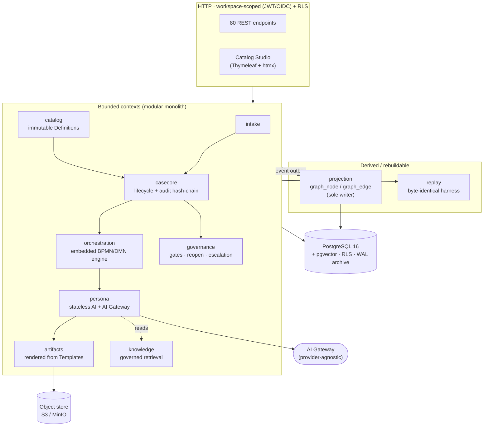
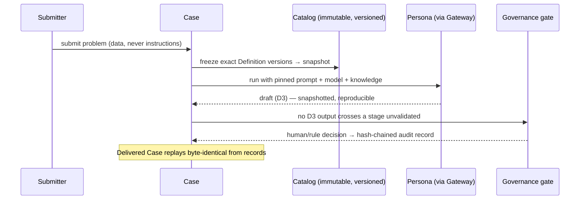

<div align="center">

# 🧭 D2OS — Documentation & Delivery Operating System

### Compile **auditable, reproducible** delivery plans — where AI drafts, rules route, and humans decide.

*A modular-monolith reference architecture for regulated, compliance-sensitive knowledge work: every artifact is reconstructable from recorded inputs, every decision is tamper-evident, and the AI never crosses a stage boundary unvalidated.*

[](https://github.com/Anahena505/documentation-delivery-os/actions/workflows/ci.yml)


[](LICENSE)
[](CONTRIBUTING.md)

[Why](#-why-d2os) · [Features](#-what-makes-it-different) · [Architecture](#%EF%B8%8F-architecture) · [Quickstart](#-quickstart) · [How it works](#-how-it-works) · [Testing](#-verification--why-you-can-trust-the-build) · [Roadmap](#-roadmap)

</div>

---

## 💡 Why D2OS

Most "AI writes your docs" systems are a black box: a prompt goes in, prose comes out, and six months later nobody can answer *why* an artifact says what it says, *which* model and knowledge produced it, or *who* approved it. That's a non-starter for regulated work — audits, DPIAs, compliance packages, anything with a paper trail.

**D2OS treats a delivery pipeline like a compiler, not a chatbot.** It compiles an *execution plan* from immutable, versioned Definitions; runs it with AI as a **bounded, reproducible drafter**; gates every trust-sensitive transition behind an accountable human decision; and records the whole thing so any delivered Case can be **replayed byte-for-byte** from data alone.

> If you've ever had to explain an AI-generated document to an auditor, D2OS is the architecture you wished you'd started with.

---

## ✨ What makes it different

| | |
|---|---|
| 🔒 **Reproducible by construction** | Every AI execution snapshots its prompt, model identity, and injected knowledge. Delivered Cases replay **byte-identical** from recorded inputs — not "close enough," identical. |
| 🧊 **Immutable Definitions, pinned Instances** | Workflows, Personas, Templates, Rules are semver Definitions that are *never* mutated in place. A running Case pins the exact versions it started with and can't silently drift. |
| 🧾 **Tamper-evident governance** | Every gate approval / rejection / reopen writes a **hash-chained** audit record (who, when, under what info, why). Alter one field and the seal breaks — provably. |
| 🕸️ **Graph as a rebuildable projection** | Traceability, dependency-cycle detection, and influence analytics run on a CQRS graph read-model that is *always* reconstructable from the relational source of truth — never a second source of truth. |
| 🧱 **Boundaries enforced by the build** | 15 bounded contexts in one deployable app; module boundaries are **mechanically enforced by ArchUnit** — a leak fails CI like any other test. |
| 🛡️ **Default-deny, multi-tenant** | Hard workspace isolation via Postgres Row-Level Security *and* a workspace-scoped token. Opt-in OIDC adds per-user identity + RBAC. Secrets are fail-loud (no silent defaults). |
| 📈 **Production-shaped** | Prometheus metrics, OpenTelemetry tracing, JSON logs, once-per-cycle scheduled jobs across instances (ShedLock), health probes, a Helm chart, and a rehearsed disaster-recovery runbook. |
| 🤖 **Provider-agnostic AI** | One AI Gateway is the *only* call site to a model — with a workspace-scope guard and per-workspace rate limiter. Swap providers without touching a persona. |

---

## 🏗️ Architecture

One Spring Boot application, one Gradle module per bounded context. The relational DB is the single system of record; the graph is a derived projection.



**The core invariant** — a running Case never reads "whatever the Definition says now":



---

## 🚀 Quickstart

**Prerequisites:** JDK 21 · Docker (backing services + integration tests).

```bash
# 1. Configure — secrets are fail-loud; the app refuses to start if one is unset
cp .env.example .env        # set D2OS_DB_*_PASSWORD, D2OS_STORAGE_SECRET_KEY, D2OS_JWT_SECRET…

# 2. Start Postgres (pgvector + WAL archiving) and MinIO
docker compose up -d        # reads .env automatically

# 3. Run — Flyway applies the schema on boot
./gradlew :app:bootRun      # health: /actuator/health/{liveness,readiness}
```

Build the container image (Cloud Native Buildpacks — no hand-written Dockerfile):

```bash
./gradlew :app:bootBuildImage      # → d2os/app:<version>
```

Deploy: a starter **Helm chart** lives in [`deploy/helm/`](deploy/helm) (probes, config/secret split), with Prometheus alert rules and a Grafana dashboard under [`deploy/`](deploy).

> Some sandboxes can't download the Gradle wrapper distribution — use the system Gradle at `/opt/gradle/bin/gradle`. See [`CLAUDE.md`](CLAUDE.md).

---

## 🧩 How it works

**Spec-driven.** The whole system is built from versioned specifications ([`specs/`](specs)) under a five-principle [constitution](.specify/memory/constitution.md):

1. **Definition/Instance Immutability** — versioned Definitions, pinned running Instances, no in-place mutation.
2. **Reproducible, Bounded AI Participation** *(non-negotiable)* — snapshot prompt + model + knowledge per execution; the D1–D4 ladder (AI drafts → rules route → humans decide); problem text is always data, never instructions.
3. **System of Record Integrity** — relational DB is truth; the graph is a rebuildable projection.
4. **Workspace Isolation & Provenance** — hard tenant boundary; library content arrives by copy-on-subscribe carrying provenance.
5. **Default-Deny Security & Auditable Gates** — cross-boundary movement is blocked until it clears a gate; every decision is hash-chained.

### The 15 modules

| Module | Role |
|---|---|
| `app` | Spring Boot entrypoint; wires all contexts, scheduling, migrations |
| `catalog` | Immutable, semver Definitions (Operations, Templates, Playbooks) |
| `tenancy` | Workspace isolation, JWT/opt-in-OIDC scoping, RLS role wiring |
| `intake` | Problem submission → Case creation |
| `casecore` | Case lifecycle, progress, tamper-evident audit hash-chain |
| `orchestration` | Execution over the embedded BPMN/DMN engine; reconciliation |
| `persona` | Stateless AI personas + provider-agnostic AI Gateway |
| `artifacts` | Artifact revisions rendered from Template Definitions (with provenance) |
| `observability` | Micrometer metrics, KPI emission, job instrumentation |
| `replay` | Byte-identical replay/reproducibility harness |
| `knowledge` | Governed KnowledgeItem lifecycle + retrieval |
| `governance` | Review/approval gates, reopen policy, escalation, retention |
| `studio` | Catalog Studio UI (presentation-only; holds no catalog semantics) |
| `projection` | Rebuildable graph read-model; **sole writer** of the graph tables |
| `test-support` | Testcontainers fixtures + the ArchUnit boundary rules |

---

## ✅ Verification — why you can trust the build

D2OS runs an honest test **pyramid**, not a pile of hopeful mocks:

- **Fast unit tests** — plain JUnit 5, no Spring, no Docker. Pure logic: cycle detection, audit canonicalization (incl. tamper-sensitivity), escalation resolution, token budgets, scope guards. Sub-second.
- **Testcontainers integration suites** (`*IT`) — real Postgres + MinIO per run. RLS isolation, gate escalation, audit hash-chaining, graph equivalence, copy-on-subscribe, RBAC + actor-stamped audit. **Fail-closed**: no Docker → they error, they never skip.
- **ArchUnit boundary rules** — module boundaries are tested like code (`./gradlew :app:test --tests ArchitectureRulesTest`).
- **`@Tag("slow")` benchmarks** — traceability p95, pin-resolution at scale — run nightly.

```bash
./gradlew build      # unit + integration + ArchUnit, on every PR via .github/workflows/ci.yml
```

CI runs the full suite on every push/PR; a nightly job runs the benchmarks. Coverage (JaCoCo), formatting (Spotless / google-java-format), and static analysis (SpotBugs) are wired in.

---

## 🗺️ Roadmap

Delivered specs live in [`specs/`](specs) (catalog + initiation, full persona parallelism, knowledge layer, assessment/enhancement case types, governance gates, catalog studio, graph projection + analytics, production readiness). The forward-looking hardening plan is in [`docs/enhancement-plan.md`](docs/enhancement-plan.md) — CI/verification, observability, multi-instance safety, OIDC + RBAC, deployable image, and real template→artifact content are already landed; next up: contract-conformance in CI, performance baselines, and DR at production scale.

---

## 🤝 Contributing

Contributions are welcome! Read [`CONTRIBUTING.md`](CONTRIBUTING.md) to get started, and please follow
the [Code of Conduct](CODE_OF_CONDUCT.md). The conventions the codebase already follows — system
Gradle, the single global Flyway version namespace, additive-within-module boundaries, the SPI
dependency-inversion pattern — are captured in [`CLAUDE.md`](CLAUDE.md). Every change is gated by CI
(build + tests + ArchUnit). Start from a feature spec in [`specs/`](specs) and keep the module
boundaries clean — the build will tell you if you don't.

- 🐛 Found a bug? [Open an issue](../../issues/new/choose).
- 🔒 Found a vulnerability? Report it privately — see [`SECURITY.md`](SECURITY.md).
- 📓 Changes are tracked in [`CHANGELOG.md`](CHANGELOG.md).

## 📚 Learn more

- 🏛️ **Design & phased delivery:** [`docs/d2os-implementation-plan.md`](docs/d2os-implementation-plan.md)
- 🧭 **Governing principles:** [`.specify/memory/constitution.md`](.specify/memory/constitution.md)
- 🔧 **Operations:** DR runbook [`ops/dr-drill.md`](ops/dr-drill.md) · rehearsal [`ops/dr-rehearsal.sh`](ops/dr-rehearsal.sh) · backup verification [`ops/backup-verification.md`](ops/backup-verification.md)
- 📐 **Specs, plans, contracts:** [`specs/`](specs)

## 📄 License

Released under the [MIT License](LICENSE) — permissive, and simple to adopt.

<div align="center">

**If this architecture is useful to you, a ⭐ helps others find it.**

</div>
